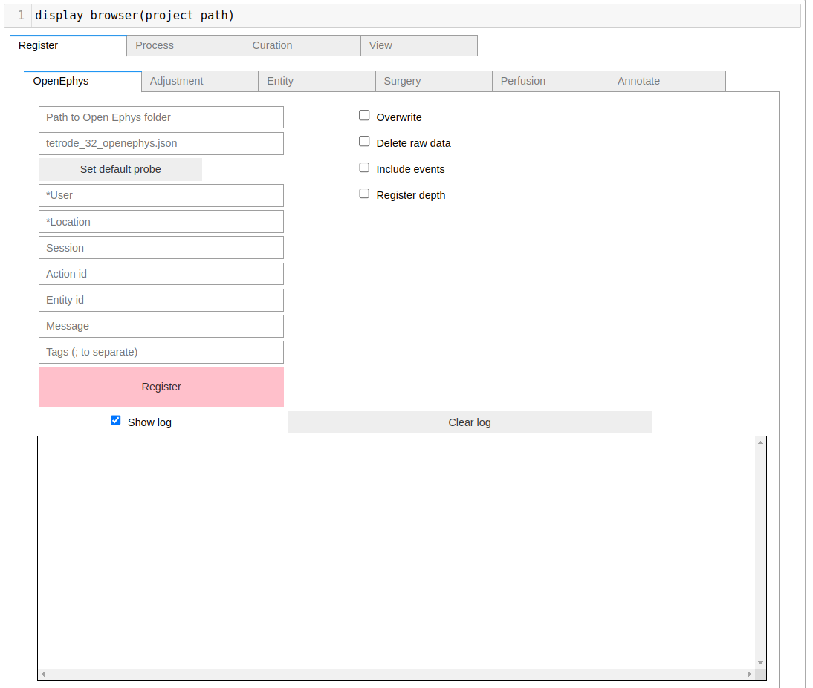

# Expipe plugin CINPLA

Expipe plugin for CINPLA laboratory


## Installation

You can install the package with pip:

```bash
>>> pip install expipe-plugin-cinpla
```

or from sources:

```bash
git clone
cd expipe-plugin-cinpla
pip install -e .
```

## Usage

The starting point is a valid `expipe` project. Refer to the [expipe docs]() to read more on how
to create one.

The recommended usage is via Jupyter Notebook / Lab, using the interactive widgets to Register, Process,
Curate, and View your actions.

To launch the interactive browser, you can run:
```python
from expipe_plugin_cinpla import display_browser

project_path = "path-to-my-project"

display_browser(project_path)

```




## Updating old projects

The current version uses Neurodata Without Borders as backend instead of Exdir. If you have an existing
project created with the old version, you can convert it to a new project as follows:

```python
from expipe_plugin_cinpla import convert_old_project

old_project_path = "path-to-old-project"
new_project_path = "path-to-new-project"

probe_path = "path-to-probe-path.json" # see probes/ folder

convert_old_project(old_project_path, new_project_path, probe_path)
```

To check out other options, use `convert_old_project?`

